# DockHost

---

## 🛠️ Tech Stack

| Category | Technologies |
| :--- | :--- |
| **Backend Frameworks** | Spring Boot, Node.js |
| **Frontend** | React.js, Tailwind CSS |
| **DevOps & Containers** | Docker |
| **Cloud Storage** | Amazon S3 |
| **Database** | MongoDb|
| **Message Broker** | RabbitMQ |
| **Payment Gateway** | Razorpay |
| **Security / Auth** | Google OAuth 2.0, JWT |

---

## 🚀 Key Features & Architecture

### 1. Containerized Build & Scalable Storage Pipeline
* **Isolated Build Environment:** Leverages Docker containers to dynamically pull repositories, run build commands, and compile static assets in a secure, sandboxed environment.
* **Optimized Distribution:** Automated pipeline seamlessly uploads optimized production builds directly to Amazon S3 for high-availability.

 * **Choose any subdomain name you bought using razorpay**
   
  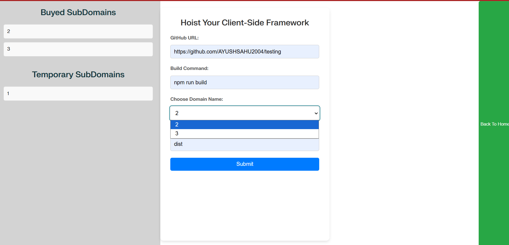
  
 * **Isolated Build Process inside Docker**
   
    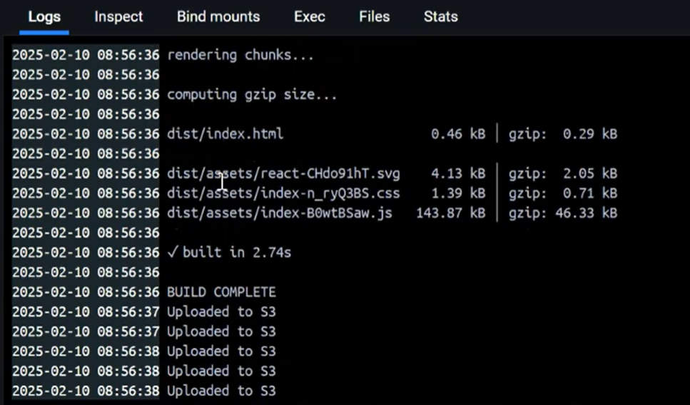
    
 * **Build Files Uploaded in s3**

    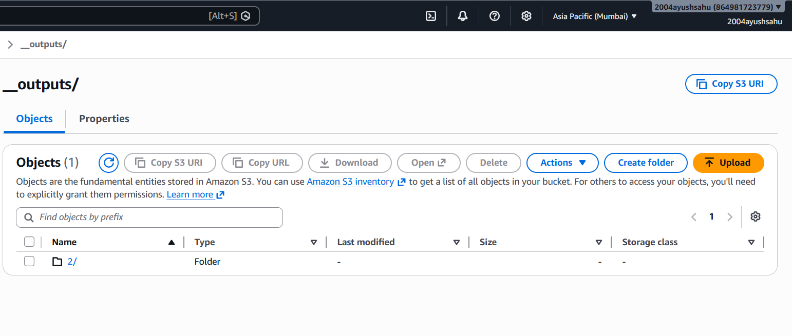

---

### 2.High-Throughput Reverse Proxy
* **Implements a custom HTTP proxy layer that streams static assets directly from Amazon S3 to the client without buffering or loading payload data into server memory, eliminating CPU/RAM bottlenecks and preventing server overload.**

* **Got the hoisted website using reverse proxy**
   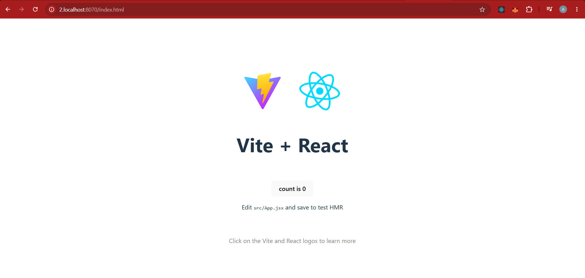

### 3.Secure Authentication and payment
* **Robust Security & Mitigation:** Integrates Google OAuth 2.0 with short-lived JSON Web Tokens (JWT) and advanced token handling mechanisms to rigorously eliminate Cross-Site Request Forgery (CSRF) and Cross-Site Scripting (XSS) vulnerabilities.
* **Before Login**
 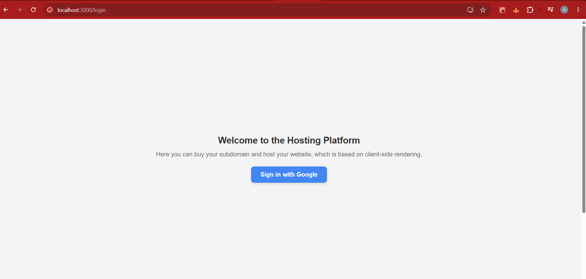
* **During Login**
   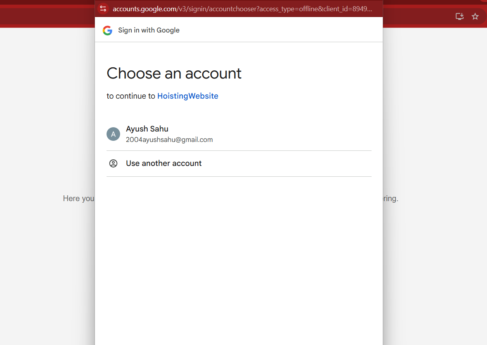
   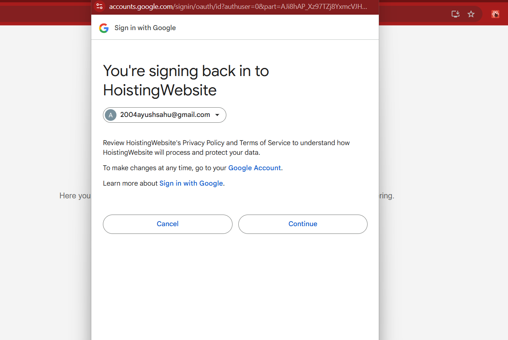
* **After Login u can choose any subdomain to buy if available**
   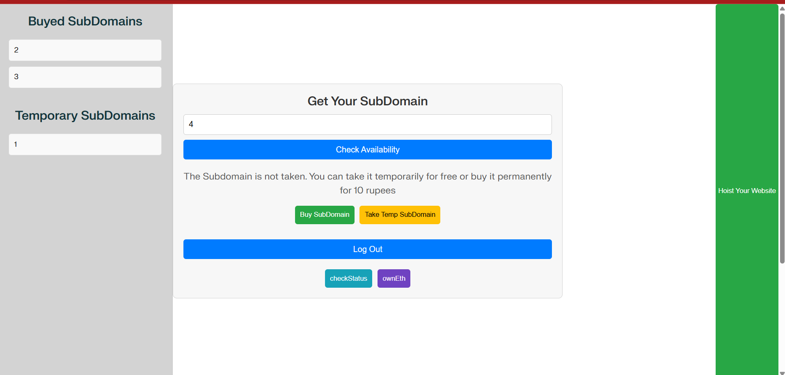
* **Monetization & Gateways:** Integrated with Razorpay to handle smooth, secure commercial tier upgrades and transaction flows.
* **During Payment**
   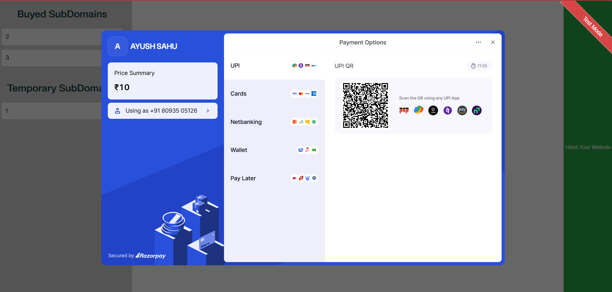
   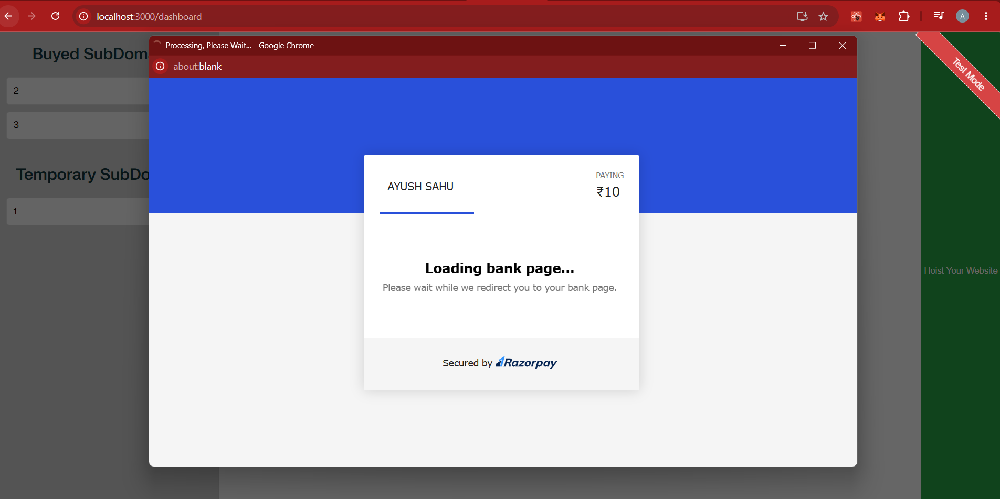
   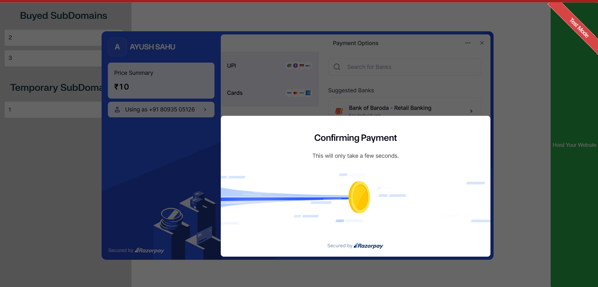
* **Successful Payment**
  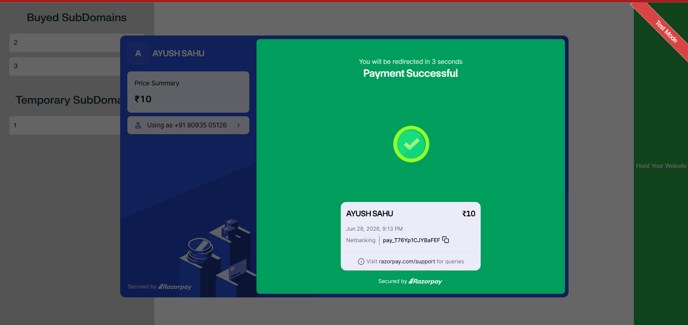

### 3.MultiThreaded Website Status Updater
* **Built with Spring Boot utilizing Java’s `ExecutorService` and `HttpClient` to concurrently poll and monitor website uptime across thousands of hosted domains.**
* **Features a high-speed in-memory caching tier to reduce database overhead during repetitive status validation cycles.**
* **Add any website you want to monitor Status**
  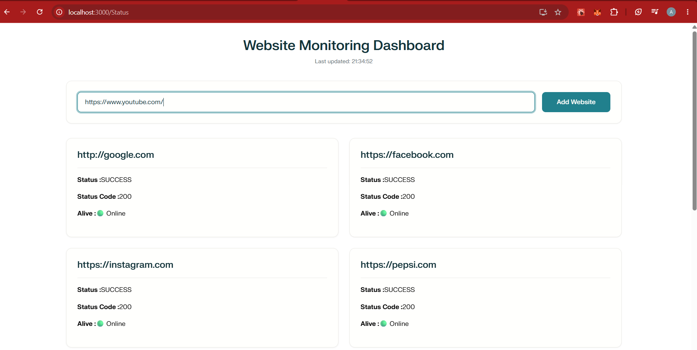

* **Nodejs rabbitmq producer sent website info to Springboot rabbitmq consumer**
 * frontend during springboot checking status
   
    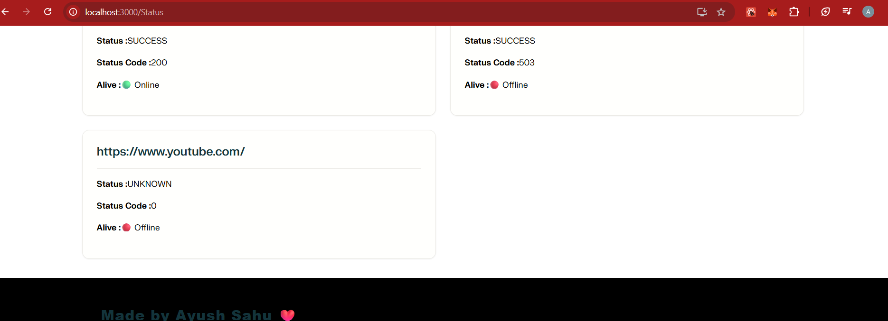
   
* **Nodejs acts as Producer Publish a Message to rabbitmq**
    
    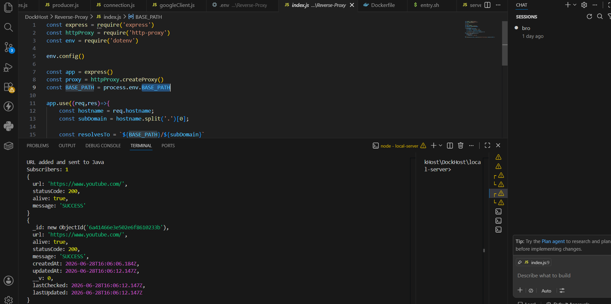

* **Springboot acts as Consumer Consumes the message from rabbitmq**
* **Springboot Scheduler takes the website from cache and starts checking the status**
   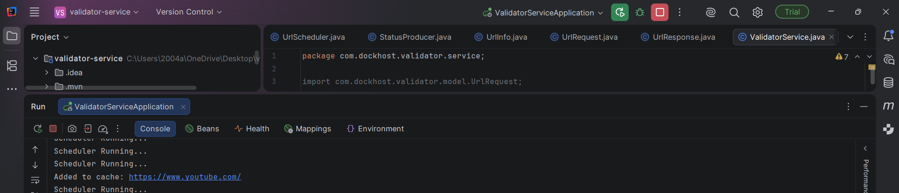

* **SpringBoot publishes the website status**
   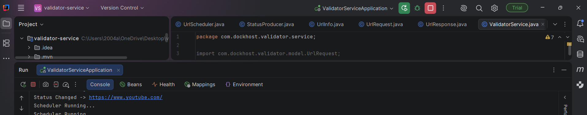
* **Nodejs consumes it and updates through socket to frontend**
   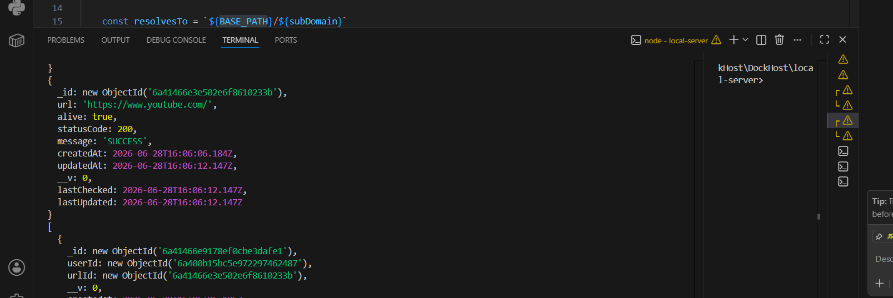
  
  

  
